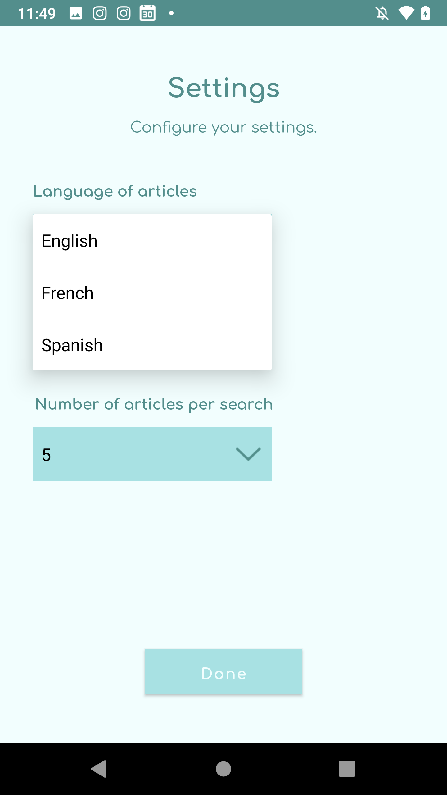
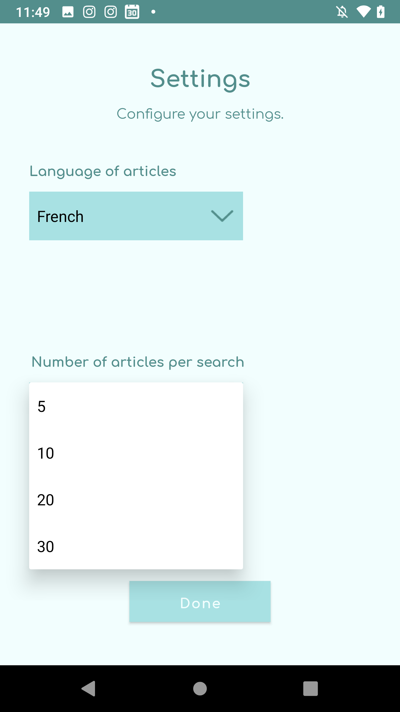
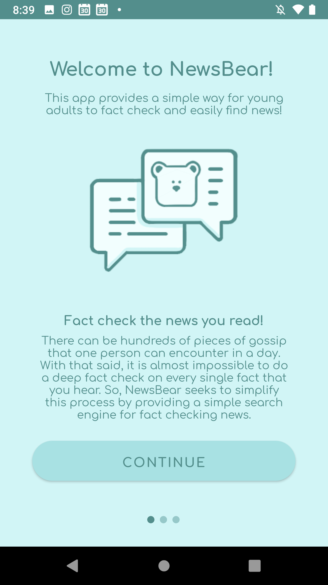

# NewsBear
Android app created for the Technovation Girls Challenge.

## **App Description:** 
In the age of the Internet and social media, teenagers are especially susceptible to fall for fake and uncredited news. Whether the article is posted to convince the reader of a certain biased siding, or to shock them into sharing for publicity, propagated manipulation through these posts can negatively and unjustly affect a young person’s opinion and mental health. NewsBear is an easy-to-use Android app for teenagers that helps them find and share fact checked news articles.

## **App Features:** 
- Keyword search for fact checked articles using the *Google Fact Check API*
- Speech-to-text search
- Suggestions given by using headlines from the *Google News API* and keywords extracted from the *TextRazor Keyword Extractor API*
- Organized layout of results (displays article title, review, date, and description)
- Sharing with other communication apps on the device
- Button that opens the full fact checked article in device's browser
- Language and number of articles per search settings
- First time users will see an introduction to the app

## Screenshots:
### **Main Screen**

### **Results Screen (English and French)**

### **Settings Screen**

### **Introduction Screens**

Thank you for reading!
